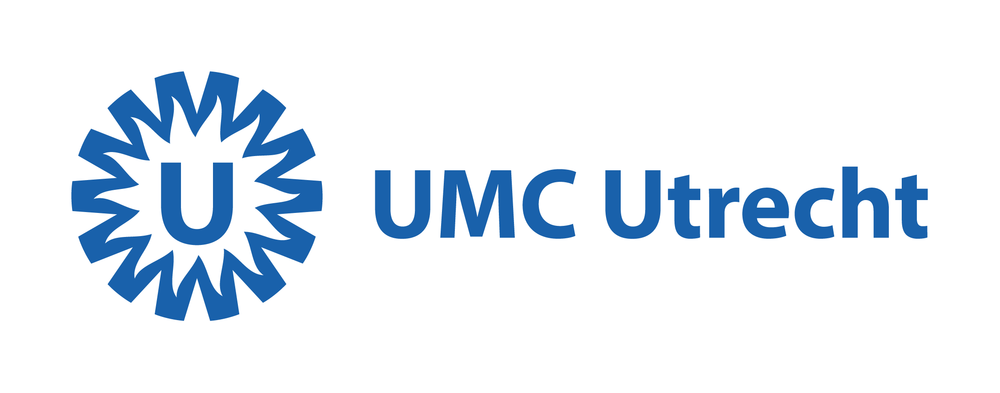

## [PubMed Miner](https://github.com/swvanderlaan/PubMed_Miner)

[](https://skillicons.dev) 

Mine PubMed for publication at the Central Diagnostics Laboratory of the Division Laboratories, Pharmacy and Biomedical genetics at the University Medical Center Utrecht, Utrecht University, Utrecht, The Netherlands.

This `pubmed_miner.py` script retrieves PubMed publications for a list of authors (and their aliases) and departments from UMC Utrecht. It then analyzes the publication data and saves the results to a Word document and an Excel file, and also produces a few graphs on the fly.


### How to install

To install follow these instructions. First, clone the repository to a directory of your choice:

```
cd to_directory_of_choice
git clone 

```

Next, create a new conda environment:

```
mamba create --name pubmedminer python=3.9
```

Activate the environment:

```
conda activate pubmedminer
```

Install the required packages:

```
mamba install biopython python-docx matplotlib numpy pandas
```

And some `pip` packages:

```
pip install xlsxwriter
```

### How to use

The script is really easy to use. You can run it from the command line. For example:

```
python pubmed_miner.py --email your_mail@whatever.com --verbose --year 2023-2024 --names "last_name IN"
```

Some arguments are required and some are optional. You can see the help message by running:

```
python pubmed_miner.py --help
```

Required arguments:
    `-e`, `--email` <email-address>  Email address for PubMed API access.

Optional arguments:
    `-n, `--names` <names>          List of author names to search for. 
                                    Default: `{DEFAULT_NAMES}` with these aliases: `{ALIAS_MAPPING}`.
    `-d`, `--departments` <depts>    List of departments to search for. Default: `{DEFAULT_DEPARTMENTS}`.
    `-org`, `--organization` <org>   Organization name for filtering results. Default: `{DEFAULT_ORGANIZATION}`.
    `-y`, `--year` <year>            Filter publications by year or year range (e.g., 2024 or 2017-2024).
    `-o`, `--output-file` <file>     Output base name for the Word and Excel files. Default: date_CDL_UMCU_Publications.
    `-r`, `--results-dir` <dir>      Directory to save results. Default: results.
    `-v`, `--verbose`                Enable verbose output.
    `-V`, `--version`                Show program's version number and exit.

### Acknowledgements
Dr. Sander W. van der Laan is funded through EU H2020 TO_AITION (grant number: 848146), EU HORIZON NextGen (grant number: 101136962), EU HORIZON MIRACLE (grant number: 101115381), and Health~Holland PPP Allowance ‘Getting the Perfect Image’.

We are thankful for the support of the Leducq Fondation ‘PlaqOmics’ and ‘AtheroGen’, and the Chan Zuckerberg Initiative ‘MetaPlaq’. The research for this contribution was made possible by the AI for Health working group of the [EWUU alliance](https://aiforhealth.ewuu.nl/). The collaborative project ‘Getting the Perfect Image’ was co-financed through use of PPP Allowance awarded by Health~Holland, Top Sector Life Sciences & Health, to stimulate public-private partnerships.

### Disclosures
Dr. Sander W. van der Laan has received Roche funding for unrelated work.

#### Changes log
    
    _Version:_      v1.0.3</br>
    _Last update:_  2024-11-15</br>
    _Written by:_   Sander W. van der Laan (s.w.vanderlaan-2[at]umcutrecht.nl).
    
    **MoSCoW To-Do List**
    The things we Must, Should, Could, and Would have given the time we have.
    _M_

    _S_

    _C_

    _W_

    **Changes log**
    * v1.0.3, 2024-11-15: Expanded Word-document information.
    * v1.0.2, 2024-11-15: Added retry logic for PubMed API, better logging for aliases, results directory customization, improved input validation, enhanced plotting, and bar annotations.
    * v1.0.1, 2024-11-15: Added alias handling for authors, improved deduplication of YearCount and PubTypeYearCount in Excel, added Authors column.
    * v1.0.0, 2024-11-14: Initial version. Added --year flag for filtering by year range, adjusted tables and figures by author. Stratified tables and figures for each author in DEFAULT_NAMES. Summarized results in Word and Excel files. Added support for "Access Type" in Publications sheet.


--------------

#### MIT License
##### <a href='https://www.umcutrecht.nl/en/centraal-diagnostisch-laboratorium'></a> Copyright (c) 1979-2024. Sander W. van der Laan | s.w.vanderlaan [at] gmail [dot] com | https://vanderlaanand.science.